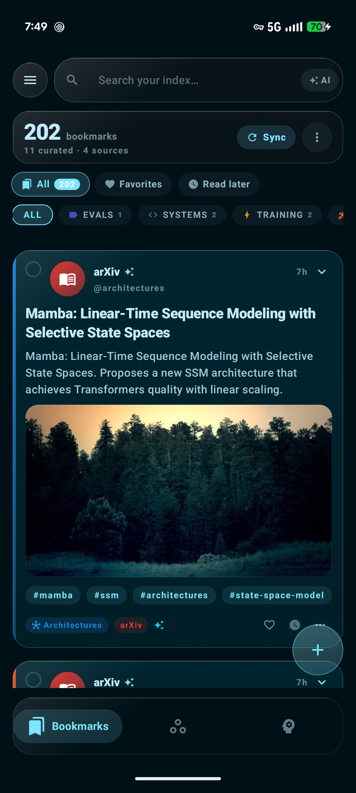
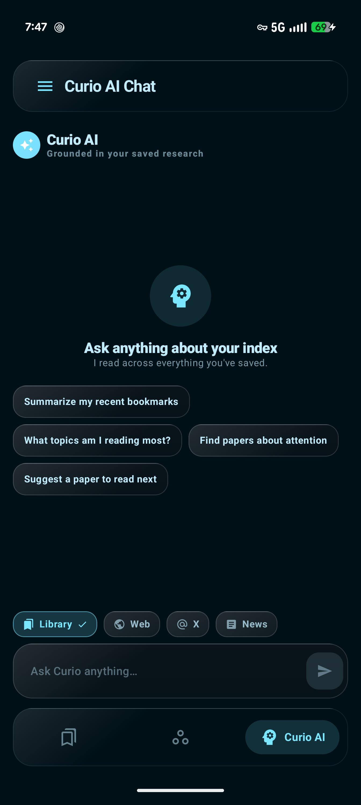

<div align="center">


# Curio

**Native on-device AI bookmark assistant for Android & iOS** — OCR, primary-source resolution, rule-based Smart Spaces, and a local semantic layer with cache, RAG compression, and routing, wrapped in a frosted Liquid-Glass UI.

</div>

---

Curio turns a messy pile of saved links and screenshots into a searchable, self-organizing library. It runs natively on both **Android 14+ (API 31+)** and **iOS 26+**, providing a unified, privacy-first experience. By combining local, on-device AI models (Gemini Nano on Android, Apple Intelligence Foundation Models on iOS) with on-device vector search (EmbeddingGemma) and an intelligent cloud fallback (xAI Grok), Curio helps you curate, chat with, and export your personal knowledge graph.

## Features

- 📥 **OAuth 2.0 PKCE Sync** — Secure login to X (Twitter) bookmarks, paginated syncing of historical entries, and automated background token rotation.
- 🔎 **On-Device OCR** — Local text recognition (Google ML Kit on Android, Apple Vision on iOS) that extracts text from screenshots, making image-based bookmarks fully searchable.
- 🤖 **Hybrid AI Curation** — Gated local LLM execution (Gemini Nano on Android, SystemLanguageModel on iOS) with automatic fallback to cloud xAI Grok (using `grok-3-mini` for summaries and `grok-3` for chat).
- 🧠 **On-Device Semantic Layer** — Local embedding indexing (EmbeddingGemma via LiteRT/CoreML) that powers:
  - **Semantic Search**: Cosine similarity vector search over raw content, OCR, and summaries.
  - **Semantic Cache**: Semantically matches incoming queries against cached answers with active similarity threshold calibration.
  - **Complexity Routing**: Routes simple queries to fast responses and complex questions to deep xAI reasoning.
  - **RAG MMR Compression**: Uses Maximal Marginal Relevance (MMR) to choose the most diverse and relevant bookmarks, maximizing recall within a strict token budget.
- 📄 **Primary-Source Resolution** — Automatically resolves and extracts rich metadata from links pointing to GitHub (stars, language), arXiv (authors, abstract), Hugging Face (model cards), and Crossref (DOI references).
- 🗂️ **Spaces & Smart Spaces** — Custom categorization folders and rule-based Smart Spaces that automatically file bookmarks according to user-defined SQL/JSON rules.
- 💬 **Grounded Chat & Citations** — Talk to your library with local vector context and export structured references to BibTeX, RIS, CSL-JSON, Markdown, and CSV.
- 📊 **Insights & Analytics** — Frosted KPI metrics cards, proportional category share charts, and active topic tag clouds.
- 🔄 **ChronosFlow Interop** — Sync reading queues and task handoffs with the companion ChronosFlow planner app (ContentProvider on Android, shared App Groups on iOS).
- 🔌 **Assistants & Extensions** — Android AppFunctions and iOS App Intents for native OS assistant integration, plus system Share Sheets.
- 🎨 **Frosted Liquid Glass UI** — Stunning frosted Material You (Android) and Cosmic SwiftUI (iOS) glassmorphism that degrades to solid colors on low-RAM devices.

## Screenshots

<div align="center">


</div>

## Architecture

Curio is built using **Clean Architecture** with strict unidirectional data flow, split into a native Android app and a native iOS app.

### Directory Structure

```
curio/
├── app/                  # Native Android App (Kotlin, Jetpack Compose)
│   ├── src/main/java/com/example/
│   │   ├── data/         # Repositories, Database (Room), Retrofit API, Semantic Layer
│   │   ├── domain/       # Pure-Kotlin models, repository interfaces, use cases
│   │   └── ui/           # Compose UI screens, view models, and glass theme
│   └── build.gradle.kts
│
├── ios/                  # Native iOS App (Swift 6, SwiftUI)
│   ├── Curio/Curio/      # 12-Module SwiftUI App (Domain, Persistence, Screens, etc.)
│   ├── CurioTests/       # Swift unit and integration tests
│   ├── CurioShareExtension/ # Share sheet capture extension
│   ├── CurioActivityWidget/ # Live Activities widget
│   └── project.yml       # XcodeGen project specification
│
└── tools/                # Logo and asset pipeline generation scripts
```

### Technology Mapping (Android vs. iOS)

The Android and iOS codebases are built in parallel, mapping corresponding platform APIs:

| Component | Android (`app`) | iOS (`ios`) |
|---|---|---|
| **UI Framework** | Jetpack Compose (BOM 2026.05) | SwiftUI (iOS 26+) |
| **Local Database** | Room SQLite | SwiftData (`@Model`, `@ModelActor`) |
| **Dependency Injection** | Koin DI | `AppEnvironment` (constructor injection) |
| **Networking & HTTP** | Retrofit + OkHttp + Moshi | URLSession (`async/await`) + `Codable` |
| **On-Device OCR** | Google ML Kit Text Recognition | Apple Vision (`RecognizeTextRequest`) |
| **On-Device Embeddings** | EmbeddingGemma (LiteRT) | CoreML / `NLContextualEmbedding` |
| **On-Device LLM** | Gemini Nano (AICore API) | SystemLanguageModel (Apple Intelligence) |
| **Assistant Integration** | Android AppFunctions | App Intents (`AppIntent`, `AppEntity`) |
| **Background Work** | WorkManager | BGTaskScheduler |
| **Glass / Blur Effects** | Haze Compose library | `.glassEffect` / `GlassEffectContainer` |
| **Security & Storage** | AndroidKeyStore AES-GCM + DataStore | Keychain + CryptoKit (`AES.GCM`) |
| **OAuth Flow** | Chrome Custom Tabs | `ASWebAuthenticationSession` |
| **Reactive Streams** | Kotlin `Flow` / `StateFlow` | AsyncStream / Combine |

## Run Locally

### Android

**Prerequisites:** JDK 17+ and the Android SDK (with `ANDROID_HOME`, or a `local.properties` containing `sdk.dir`).

1. Create a `.env` file in the project root and set your xAI key (see [`.env.example`](.env.example)):
   ```
   XAI_API_KEY=your_key_here
   ```
   Get a key at [console.x.ai](https://console.x.ai). The offline classifier and local OCR work without it.
2. Build and run from the command line:
   ```bash
   ./gradlew :app:assembleDebug     # Build the debug APK
   ./gradlew :app:installDebug      # Build and install on a connected device/emulator
   ./gradlew :app:testDebugUnitTest # Run the unit tests
   ```

### iOS

**Prerequisites:** macOS with Xcode 26+, iOS 26 SDK, Swift 6 strict concurrency, and Homebrew.

1. Install XcodeGen:
   ```bash
   brew install xcodegen
   ```
2. Generate the Xcode project:
   ```bash
   cd ios && xcodegen generate
   ```
   This generates `Curio.xcodeproj`.
3. Open `Curio.xcodeproj` in Xcode 26.
4. Add your `GoogleService-Info.plist` to the Curio app target (associated with bundle ID `com.curio.app` in your Firebase Console).
5. Set your signing team on the `Curio` and `CurioShareExtension` targets.
6. Configure the client secrets via `.xcconfig` or `Info.plist` environment keys:
   - `X_CLIENT_ID` — X OAuth client ID
   - `X_REDIRECT_URI` — Custom scheme URL (e.g., `curio-oauth://callback`)
7. Select an iOS 26 simulator or device and run.

> **BYOK (Bring Your Own Key):** To keep credentials secure, the xAI API key and Hugging Face tokens are provided by the user in the app's **Settings** screen at runtime and stored locally in the **Keychain**, rather than embedded in the codebase.

## Secrets & Security

`.env`, `local.properties`, `GoogleService-Info.plist`, and keystores are gitignored and must never be committed. To enforce this, enable the bundled commit guard:

```bash
git config core.hooksPath .githooks
```

The guard blocks staging of `.env`, `*.jks`, `*.keystore`, and `local.properties` files, and rejects commits matching live xAI/X credential patterns.

---

For deep dives into the application architecture and development guidelines:
- **Android Guidelines**: See [`ARCHITECTURE.md`](ARCHITECTURE.md) and [`CHANGELOG.md`](CHANGELOG.md)
- **iOS Guidelines**: See [`ios/docs/DESIGN.md`](ios/docs/DESIGN.md) and [`ios/docs/CONVENTIONS.md`](ios/docs/CONVENTIONS.md)
